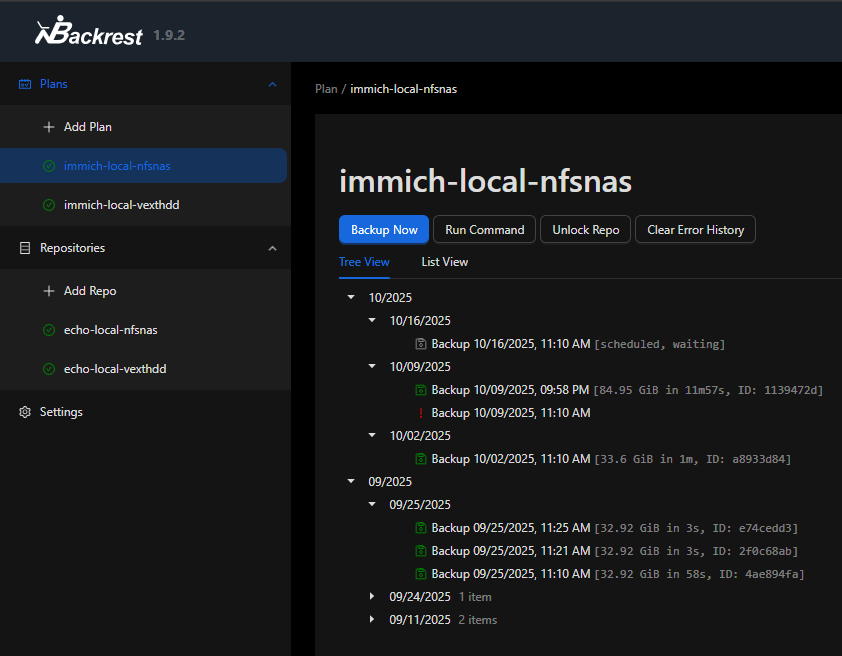

# Backup stack

## Backrest
"[Backrest](https://github.com/garethgeorge/backrest) is a web-accessible backup solution built on top of restic. 
Backrest provides a WebUI which wraps the restic CLI and makes it easy to create repos, 
browse snapshots, and restore files. Additionally, Backrest can run in the background 
and take an opinionated approach to scheduling snapshots and orchestrating repo health 
operations." - @garethgeorge, Backrest repo

## Configuration

Configured Backrest with two repositories - respective mount points in volumes.

It's setup to run once a week and do a backup for each repository, for example a NAS and an external HDD


/// caption
_Backup config example_
///

### Compose
```yaml
  backrest:
    image: garethgeorge/backrest:v1.9.2
    hostname: <your_server_hostname>
    environment:
      - BACKREST_DATA=/data
      - BACKREST_CONFIG=/config/config.json
      - XDG_CACHE_HOME=/cache
      - TMPDIR=/tmp
      - TZ=${TIMEZONE}
    volumes:
      # Backrest internal state
      - backrest_data:/data
      - backrest_config:/config
      - backrest_cache:/cache
      - backrest_tmp:/tmp
      # Mount the SAME service volumes read-only so Backrest can back them up
      - volume_to_backup:/data/volume_to_backup:ro
      - /mnt/repo1:/data/repo1
      - /mnt/repo2:/data/repo2
```
